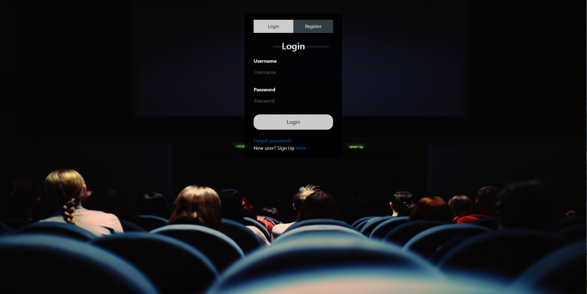
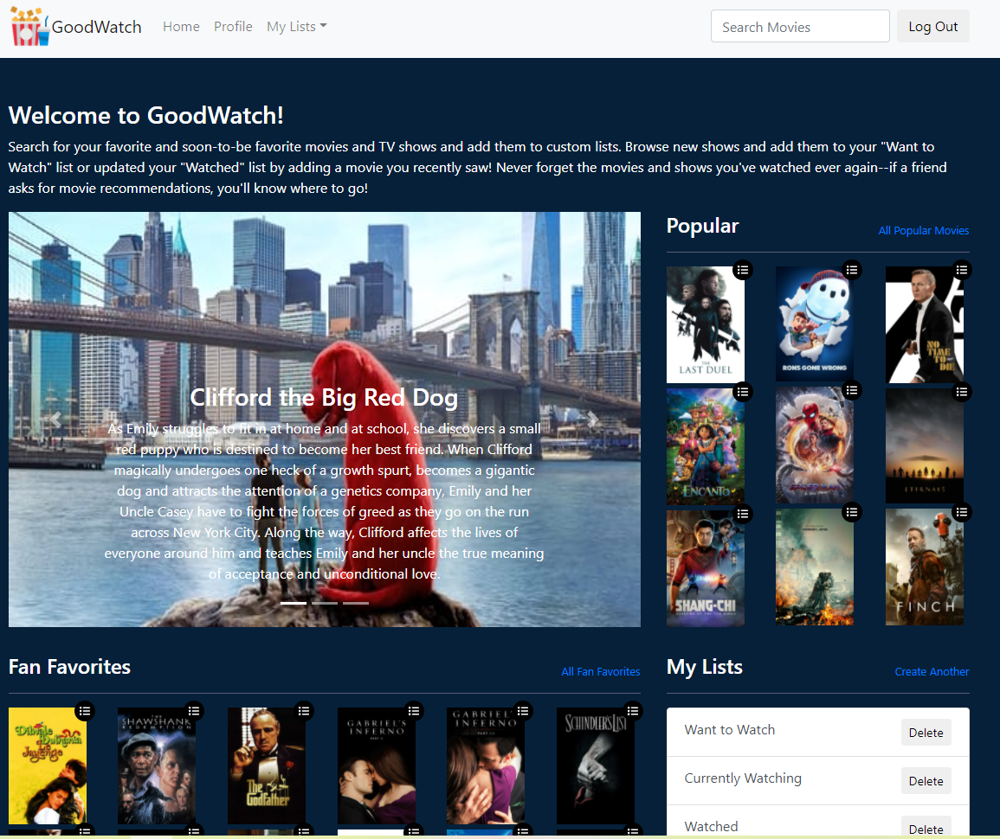
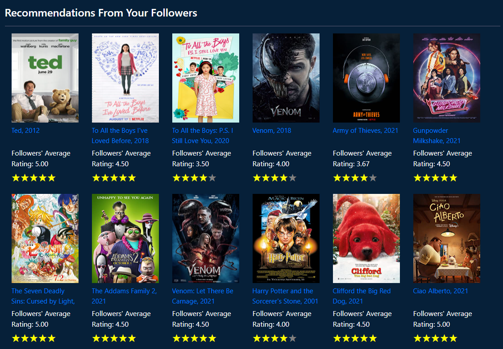

<h1>Starter code for GoodWatch</h1>

Run <strong>npm install</strong> on both frontend and backend directory to install the dependencies

Run <strong>npm start</strong> on both frontend and backend directory to start the app

Front end code is hosted at port 3000 and backend code is at port 3001

Go to <i>http://localhost:3000/</i> to see the web up and running

 JIRA: <i>https://cse437.atlassian.net/jira/software/projects/CSE437/boards/1</i>

<h1>Login</h1>

<h1>Home page</h1>

<h1>Movie search</h1>

<h1>Movie page</h1>

<h1>User profile Page</h1>

User can follow each other and maintain lists of movie interest

<h1>Movie Recommendation</h1>

Recommend movies from followers with average rating >= 3.5

<h1>Movie list</h1>

User can add movies to their list and remove them

List view

